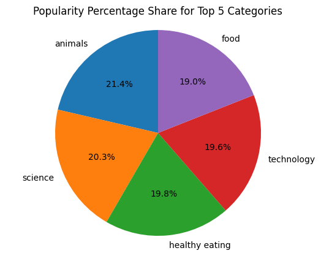

# Social Buzz Analysis

## Project Overview

The Social Buzz Analysis project aims to analyze social media data to understand trends, sentiments, and key influencers. This project leverages machine learning techniques to provide insights into social media buzz around specific topics or events.

## Objectives

- Collect and preprocess social media data
- Perform sentiment analysis
- Identify key influencers and trends
- Visualize the results

## Data Collection

Data collected from the known Source

## Data Preprocessing

- Cleaning and filtering the data
- Tokenization and normalization
- Removing stop words and irrelevant content

## Key Influencers and Trends

- Identifying users with the most influence based on engagement metrics
- Analyzing trending topics and hashtags

## Visualization

Creating visual representations of the data to provide insights into social media trends and sentiments.

## Tools and Technologies

- Python
- Pandas
- Numpy
- Scikit-learn
- NLTK
- Matplotlib
- Seaborn

## Acknowledgements

- Thanks to the open-source community for providing the tools and libraries used in this project.
- Special thanks to the contributors and collaborators.
