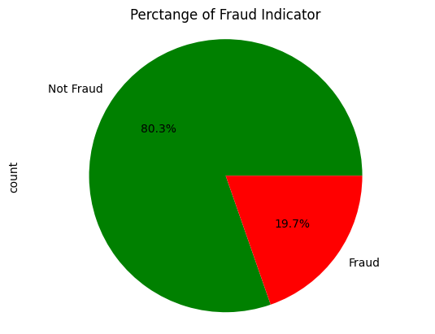
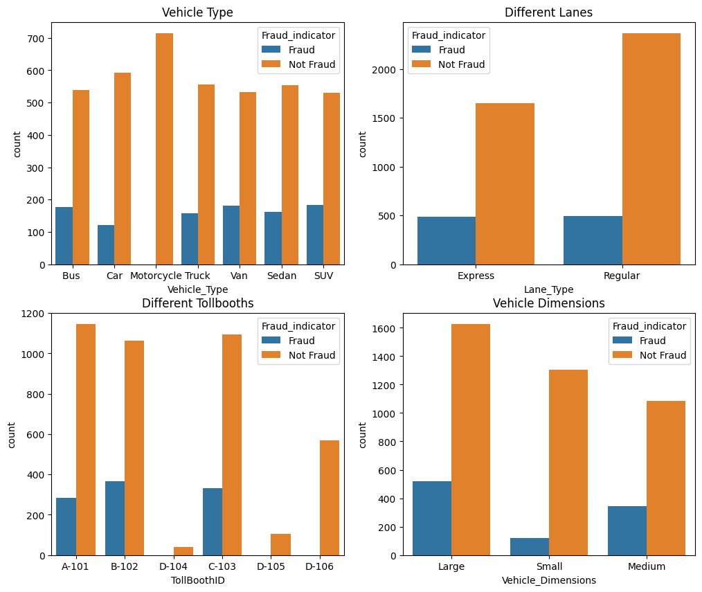
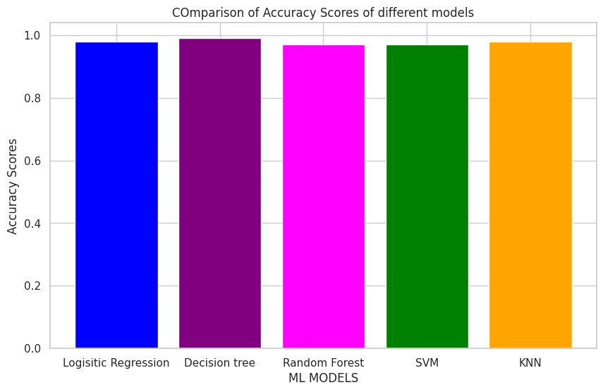

# Fastag Fraud Detection

This project focuses on detecting fraudulent transactions in Fastag systems using machine learning techniques. The analysis encompasses data preprocessing, exploratory data analysis (EDA), feature engineering, and model development to accurately identify fraudulent activities.

## Project Overview

The objective of this project is to develop a predictive model capable of distinguishing between legitimate and fraudulent Fastag transactions. By leveraging a labeled dataset, the project explores various data analysis and machine learning methodologies to enhance fraud detection capabilities.

## Dataset

The analysis utilizes the [Fastag Fraud Detection Datasets](https://www.kaggle.com/datasets/thegoanpanda/fastag-fraud-detection-datesets-fictitious), which contain fictitious data designed for educational and testing purposes in fraud detection algorithms. The dataset includes features such as transaction amounts, vehicle information, geographic locations, and transaction details, with each record labeled to indicate fraudulent activity.

## Methodology

The project follows a structured approach:

1. **Data Preprocessing**: Handling missing values, encoding categorical data, and normalizing numerical features to prepare the dataset for analysis.
2. **Exploratory Data Analysis (EDA)**: Investigating the distribution of transaction amounts, frequency of fraudulent activities, and relationships between variables to uncover patterns indicative of fraud.
3. **Feature Engineering**: Creating new features and selecting relevant ones to improve model performance.
4. **Model Development**: Implementing and evaluating various machine learning algorithms, including logistic regression, decision trees, and neural networks, to classify transactions as fraudulent or legitimate.
5. **Evaluation**: Assessing model performance using metrics such as accuracy, precision, recall, and F1-score, and refining the models to enhance detection capabilities.

## Key Findings

- **Data Imbalance**: The dataset exhibits an imbalance between fraudulent and non-fraudulent transactions, necessitating strategies such as resampling or weighting during model training.
- **Feature Importance**: Certain features, such as transaction amount and vehicle type, have a significant impact on the likelihood of a transaction being fraudulent.
- **Model Performance**: Advanced models like artificial neural networks demonstrated superior performance in detecting fraudulent transactions compared to simpler models.

## Visualizations

_Figure 1: Distribution of transaction amounts highlighting differences between fraudulent and legitimate transactions._

_Figure 2: Frequency of fraudulent transactions across different Features_

_Figure 3: Confusion matrix illustrating the performance of the selected model in classifying transactions._

## Usage

To replicate the analysis:

1. **Dataset Access**: Download the [Fastag Fraud Detection Datasets](https://www.kaggle.com/datasets/thegoanpanda/fastag-fraud-detection-datesets-fictitious) from Kaggle.
2. **Environment Setup**: Ensure the necessary Python libraries are installed, including pandas, numpy, scikit-learn, and matplotlib.
3. **Notebook Execution**: Run the Jupyter Notebook provided in this repository to perform the analysis and model training.

## Conclusion

This project demonstrates the application of machine learning techniques in detecting fraudulent Fastag transactions, highlighting the importance of data preprocessing, feature engineering, and model selection in developing effective fraud detection systems.

## Acknowledgements

Special thanks to the contributors of the [Fastag Fraud Detection Datasets](https://www.kaggle.com/datasets/thegoanpanda/fastag-fraud-detection-datesets-fictitious) on Kaggle for providing the data essential for this analysis.
