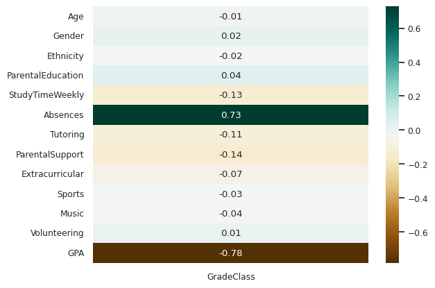
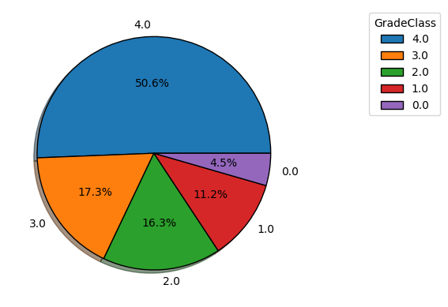
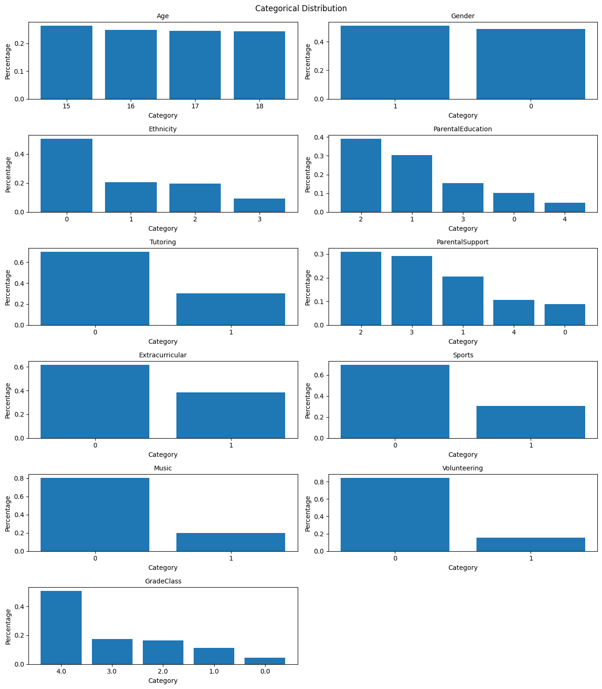

# Student Grade Predictor

This project focuses on predicting students' academic performance using machine learning techniques. By analyzing various factors that influence student grades, the model aims to provide insights that can help in identifying students who may need additional support.

## Project Overview

The objective of this project is to develop a predictive model that estimates students' grades based on a range of input features. This involves data preprocessing, exploratory data analysis (EDA), feature engineering, model selection, and evaluation to ensure accurate and reliable predictions.

## Dataset

The analysis utilizes the [Student Performance Dataset](https://archive.ics.uci.edu/ml/datasets/Student+Performance) from the UCI Machine Learning Repository. This dataset includes attributes related to student demographics, social and academic features, and their corresponding final grades.

## Methodology

The project follows a structured approach:

1. **Data Preprocessing**: Handling missing values, encoding categorical variables, and normalizing numerical features to prepare the dataset for analysis.
2. **Exploratory Data Analysis (EDA)**: Investigating the distribution of features, relationships between variables, and identifying patterns that may influence student performance.
3. **Feature Engineering**: Creating new features and selecting the most relevant ones to improve model performance.
4. **Model Development**: Implementing and evaluating various machine learning algorithms, such as linear regression, decision trees, and support vector machines, to predict student grades.
5. **Evaluation**: Assessing model performance using metrics like Mean Absolute Error (MAE), Root Mean Squared Error (RMSE), and R-squared, and refining the models to enhance predictive accuracy.

## Key Findings

- **Influential Factors**: Certain features, such as study time, previous academic performance, and parental education level, have a significant impact on student grades.
- **Data Imbalance**: The dataset may exhibit imbalances in grade distributions, which can affect model training and performance.
- **Model Performance**: Advanced models like support vector machines demonstrated superior performance in predicting student grades compared to simpler models.

## Visualizations

*Figure 1: Heatmap showing correlations between different features and student grades.*

*Figure 2: Distribution of final grades among students.*

*Figure 3: Distribution of Categorical Features*

## Usage

To replicate the analysis:

1. **Dataset Access**: Download the [Student Performance Dataset](https://archive.ics.uci.edu/ml/datasets/Student+Performance) from the UCI Machine Learning Repository.
2. **Environment Setup**: Ensure the necessary Python libraries are installed, including pandas, numpy, scikit-learn, and matplotlib.
3. **Notebook Execution**: Run the Jupyter Notebook provided in this repository to perform the analysis and model training.

## Conclusion

This project demonstrates the application of machine learning techniques in predicting student academic performance, highlighting the importance of data preprocessing, feature engineering, and model selection in developing effective predictive models.

## Acknowledgements

Special thanks to the contributors of the [Student Performance Dataset](https://archive.ics.uci.edu/ml/datasets/Student+Performance) for providing the data essential for this analysis.

