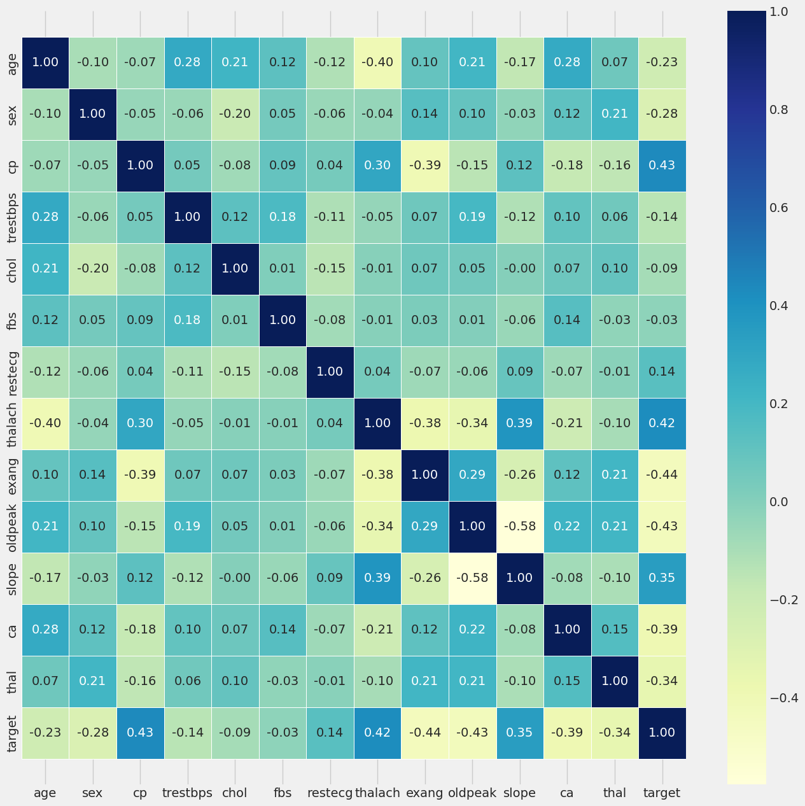
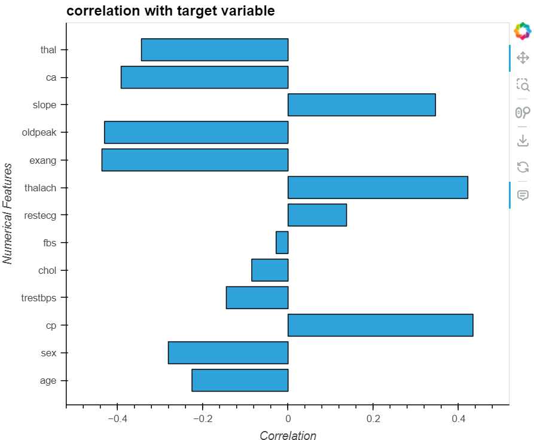
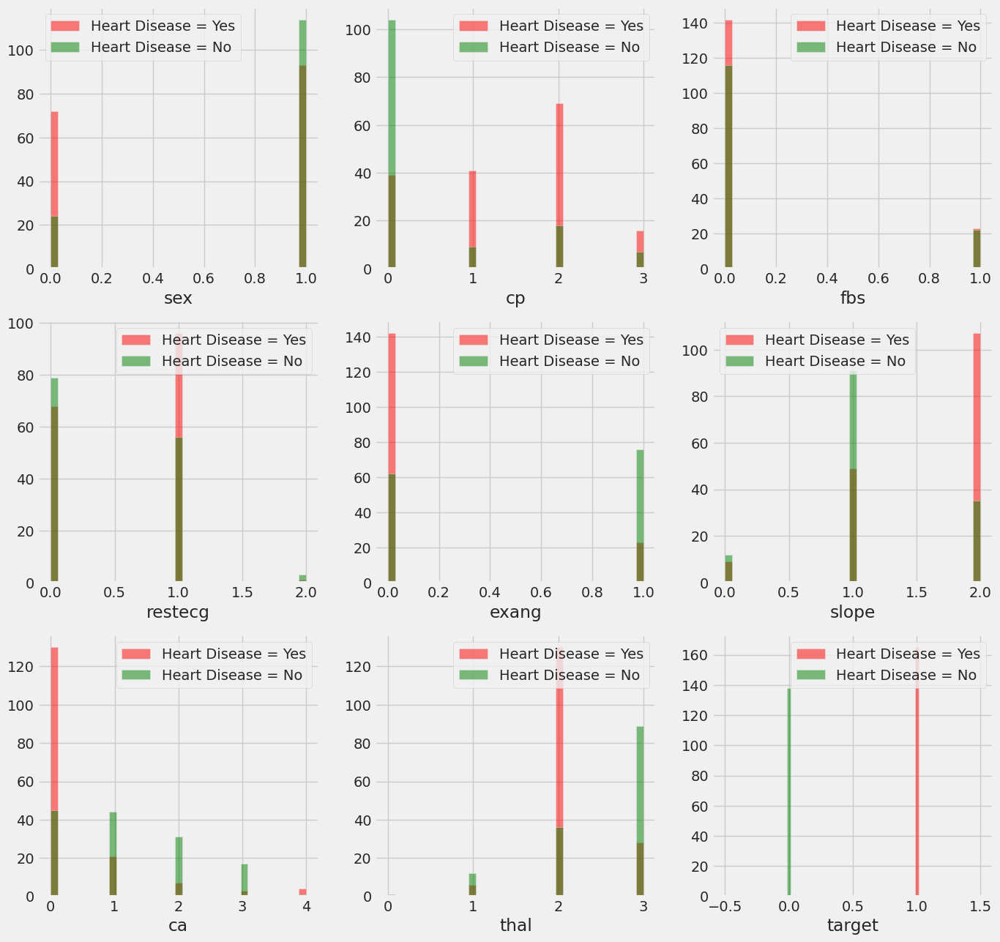
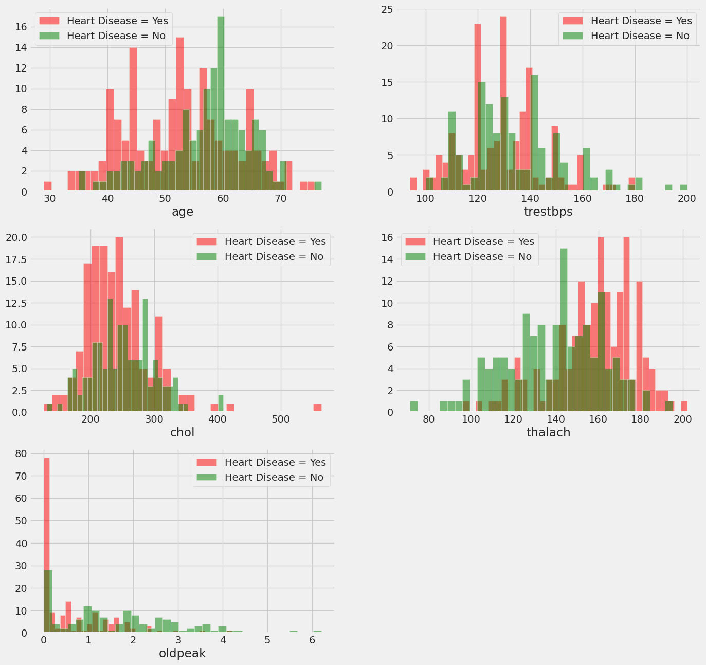
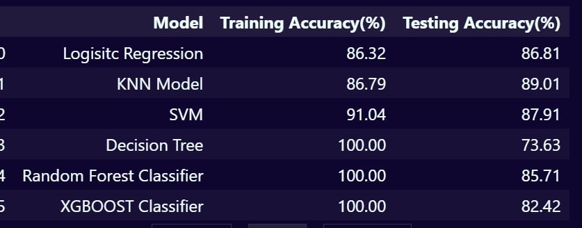

# Heart Disease Predictor

This project aims to develop a machine learning model capable of predicting the likelihood of heart disease in individuals based on various health and demographic features.

## Project Overview

Heart disease remains a leading cause of mortality worldwide. Early detection through predictive modeling can facilitate timely medical interventions. This project utilizes a dataset containing multiple health indicators to build and evaluate models that predict the presence or absence of heart disease.

## Dataset

The analysis employs the [Heart Disease Dataset](https://archive.ics.uci.edu/ml/datasets/Heart+Disease) from the UCI Machine Learning Repository. This dataset comprises 303 instances with 14 attributes, including age, sex, chest pain type, resting blood pressure, cholesterol levels, fasting blood sugar, resting electrocardiographic results, maximum heart rate achieved, exercise-induced angina, and others.

## Methodology

The project follows these steps:

1. **Data Preprocessing**: Handling missing values, encoding categorical variables, and scaling numerical features to prepare the dataset for analysis.
2. **Exploratory Data Analysis (EDA)**: Visualizing data distributions and relationships between features to uncover patterns associated with heart disease.
3. **Feature Engineering**: Selecting and transforming relevant features to enhance model performance.
4. **Model Development**: Implementing various machine learning algorithms, such as Logistic Regression, Decision Trees, and Random Forests, to predict heart disease presence.
5. **Evaluation**: Assessing model performance using metrics like accuracy, precision, recall, F1-score, and ROC-AUC.

## Key Findings

- **Feature Importance**: Attributes like chest pain type, maximum heart rate achieved, and exercise-induced angina significantly influence heart disease prediction.
- **Model Performance**: The Random Forest classifier demonstrated superior performance, achieving an accuracy of approximately 85% on the test set.
- **Data Insights**: Visualizations revealed that certain chest pain types and higher maximum heart rates are associated with a higher likelihood of heart disease.

## Visualizations

*Figure 1: Heatmap displaying correlations between features and the target variable.*

*Figure 2: Heatmap displaying correlations between features and the target variable.*

*Figure 3: Distribution of Heart Disease based on different categories.*

*Figure 4: Continuous Data Categorisation*

*Figure 5: Training and Testing Accuracy of Different models*
## Usage

To replicate the analysis:

1. **Dataset Access**: Download the [Heart Disease Dataset](https://archive.ics.uci.edu/ml/datasets/Heart+Disease) from the UCI Machine Learning Repository.
2. **Environment Setup**: Install necessary Python libraries, including pandas, numpy, scikit-learn, matplotlib, and seaborn.
3. **Notebook Execution**: Run the `HEART_DISEASE_PREDICTOR.ipynb` notebook to perform data analysis and model training.

## Conclusion

This project demonstrates the application of machine learning techniques in predicting heart disease, emphasizing the importance of data preprocessing, feature selection, and model evaluation in developing effective predictive models.

## Acknowledgements

Special thanks to the UCI Machine Learning Repository for providing the Heart Disease Dataset, which was instrumental in this analysis.

