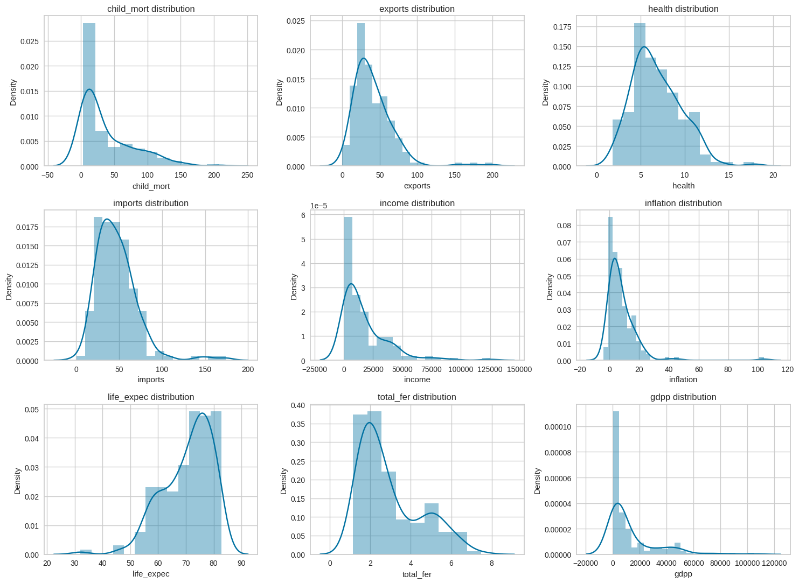
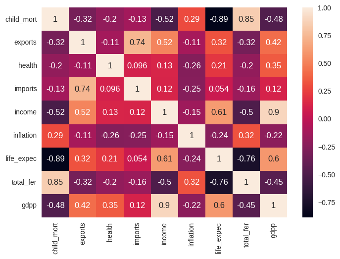
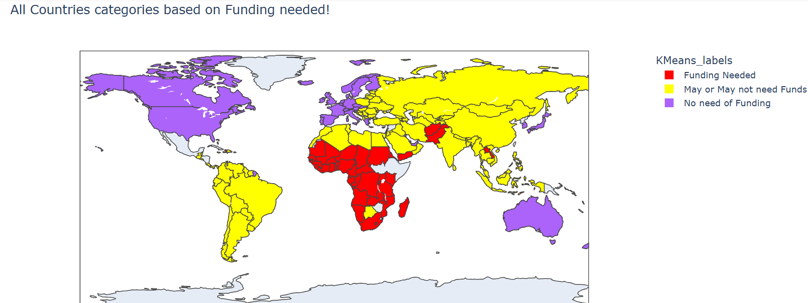
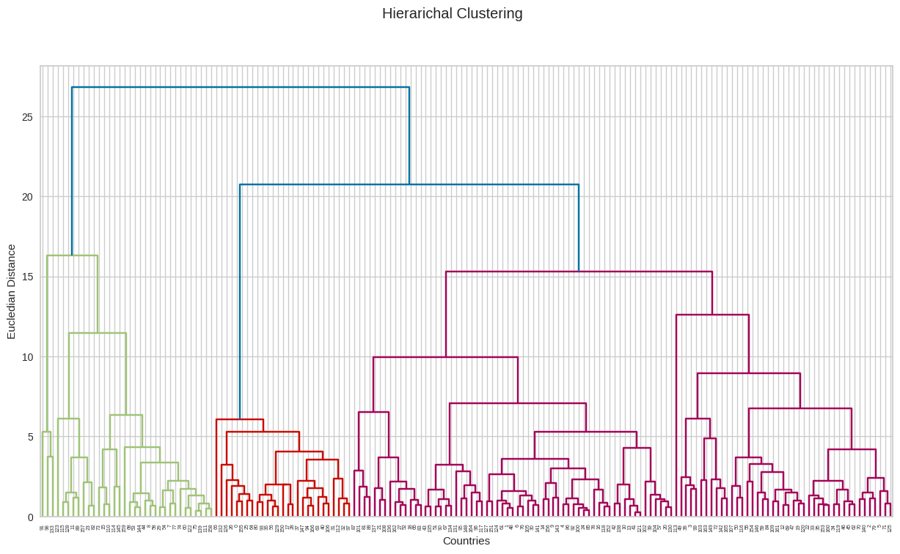

# **Using Machine Learning to Allocate Funding for Needy Countries**

This project employs unsupervised learning techniques to classify countries into three categories—**Help Needed, Maybe Help Needed, and No Help Needed**—based on various socio-economic indicators. Clustering algorithms like **K-Means, Hierarchical Clustering, and PCA** are used to group countries efficiently and optimize international aid distribution.

## **Project Overview**

International aid plays a crucial role in global development, but inefficient allocation can lead to wasted resources. This project leverages **machine learning clustering techniques** to categorize countries based on their economic and social indicators, ensuring that funding is directed where it is most needed.

## **Dataset**

The project uses data from the [Kaggle DataSet](https://www.kaggle.com/datasets/rohan0301/unsupervised-learning-on-country-data), incorporating key socio-economic metrics such as:

- **GDP per capita**
- **Poverty rate**
- **Healthcare access**
- **Education levels**
- **Unemployment rate**
- **Infrastructure development**
- **Life expectancy**  
- **Other economic and social indicators**

## **Methodology**

1. **Data Preprocessing** – Cleaning and normalizing the dataset to handle missing values and ensure consistency.  
2. **Exploratory Data Analysis (EDA)** – Identifying patterns and relationships among features through visualizations.  
3. **Dimensionality Reduction** – Applying **Principal Component Analysis (PCA)** to reduce feature complexity while preserving important variance.  
4. **Clustering Techniques** – Implementing **K-Means and Hierarchical Clustering** to group countries into three categories:
   - **Help Needed**
   - **Maybe Help Needed**
   - **No Help Needed**  
5. **Evaluation & Insights** – Visualizing clusters to understand the factors influencing aid allocation.

## **Key Findings**

- **Feature Importance:** PCA revealed that economic factors like **GDP per capita** and **poverty rate** have the highest impact on clustering results.  
- **Clustering Results:** The K-Means model effectively grouped countries into meaningful categories, with clear distinctions based on economic indicators.  
- **Hierarchical Clustering:** Provided an alternative view of country groupings, highlighting possible funding priorities.

## **Visualizations**


*Figure 1: Visualisation of numerical variables* 

 
*Figure 2: Correlation of features.*  

 
*Figure 3: K-Means clustering results showing countries grouped into different funding categories.*  


*Figure 4: Dendrogram representing country relationships in hierarchical clustering.*  

## **Usage**

To run the project on your system:  

1. **Download the dataset** from [Kaggle DataSet](https://www.kaggle.com/datasets/rohan0301/unsupervised-learning-on-country-data).  
2. **Install dependencies**:  
   ```bash
   pip install pandas numpy matplotlib seaborn scikit-learn
